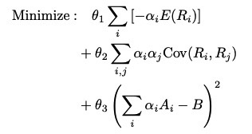
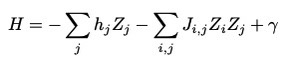
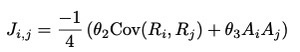
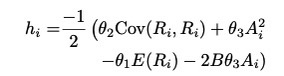
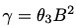
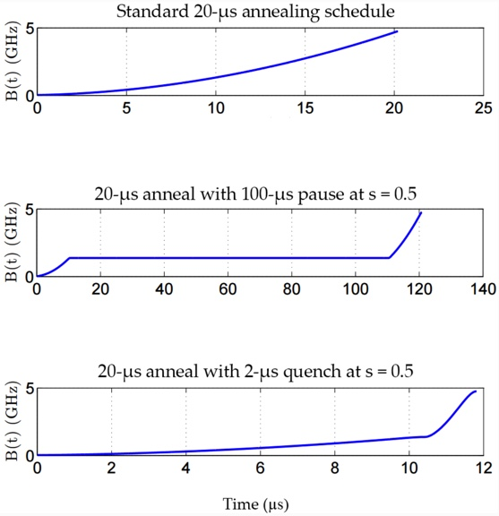
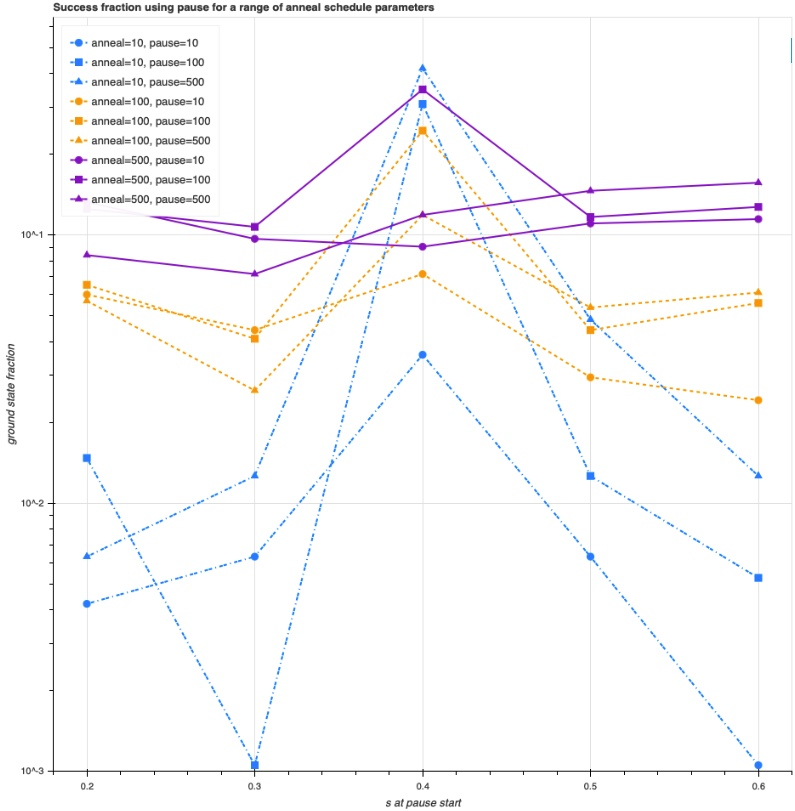
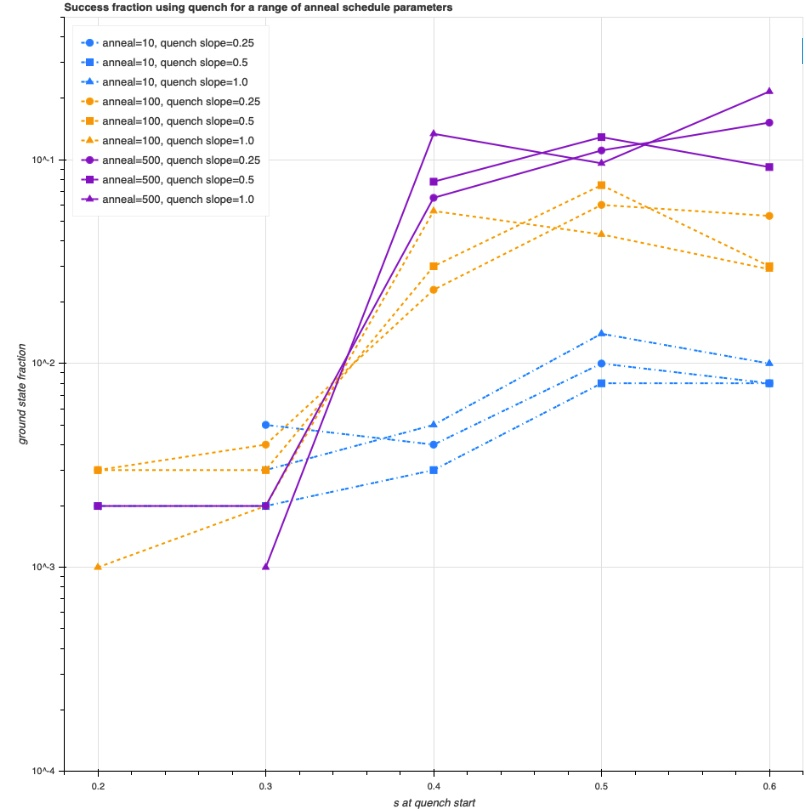

# Portfolio Optimization
### Minor Applied Quantum Computing 

Portfolio optimization with quantum annealing. Main goal is to find the optimum solution through different annealing schedules.

## Portfolio optimization
Rebalancing the combination of asset investment to maximize its return while minimizing its risk. Selecting the best portfolio out of a bunch of portfolios. Input data can be uniform random historical price data, a budget and a risk tolerance. The approach used in this repository is the Markowitz portfolio model for portfolio selection. This model is build into a quadratic unconstrained binary optimization (QUBO) problem:

\
where:
- E(R) represents the expected return;
- Alpha subjects to {0,1};
- A is the maximum amount of money that can be invested in an asset;
- B representing the total budget;
- and where Cov(Ri,Rj) is the covariance between two returning assets.

For the Quantum Annealer to act on this problem, the QUBO form needs to be mapped inside the Ising model:

\
Where the coefficients h and J define, respectively, the bias for qubit i and the coupling between qubits i and j and the Pauli Z operator is for the i-th qubit.

Mapped version:

\
\
In the original equation, Gamma has been defined as:\
\
but this has not been introduced in the notebooks.

## Quantum Annealing
Quantum annealing is similar to classical or simulated annealing, where thermal fluctuations allows
the system to jump between different local minima in the energy landscape. The energy landscape consists of peaks and valleys. The system is allowed to be manipulated in a way that causes the system to tunnel its way through the peaks and find its way to the global minima. This effect is called Quantum Tunneling. By using different annealing schedules, like pauses during the middle of the process or an instant quench in the end, might let the system behave differently. The standard annealing schedule is a linear annealing process. After some fine-grained adjustments this research might benefit from pauses and quenches.


## Dwave Leap
It is possible to make use of the DWave Quantum Computer. By creating an account on Dwave Leap, it is possible to receive some QPU time, which is only avaible for just a month. By clicking on 'GET MORE TIME', it is possible to have more access on the QPU by getting the developer access. By following the instructions, one may receive limited access on the QPU every month. Be aware that one only gets 1 minute of compile time on the QPU without a paid license. 

## Installation

``` 
pip install dwave-system

pip install dwave-neal 

pip install dimod

pip install pandas 

pip install pandas_datareader 

pip install numpy 
```

You can find the different annealing schedules implemented on the Ising Markowitz model with the Quantum Annealer in the [quantum_annealing.ipynb](quantum_annealing.ipynb) notebook. Unfortunately did my QPU time expire and wasn't I able to run the last two cells of this notebook. Next month, I will update this notebook with a complete compilation. This code but with the Simulated Annealers is available in the [simulated_annealing.ipynb](https://github.com/Lizaterdag/portfolio-optimization/blob/main/simulated_annealing.ipynb) notebook.

The plots of the schedules are not showing in the notebooks on Github, but when one decides to download the notebooks, the following schedule plots of the pauses and quenches on different slopes are visible:




## Sources
[DWave installation](https://docs.ocean.dwavesys.com/projects/system/en/stable/installation.html)\
[Paper on Portfolio management using Adiabatic Quantum Optimization](https://www.osti.gov/servlets/purl/1423041)\
[DWave Leap](https://cloud.dwavesys.com/leap/)\
[Variation Schedule images](https://docs.dwavesys.com/docs/latest/c_fd_as.html)\
[DWave documentation](https://docs.ocean.dwavesys.com/en/stable/)
